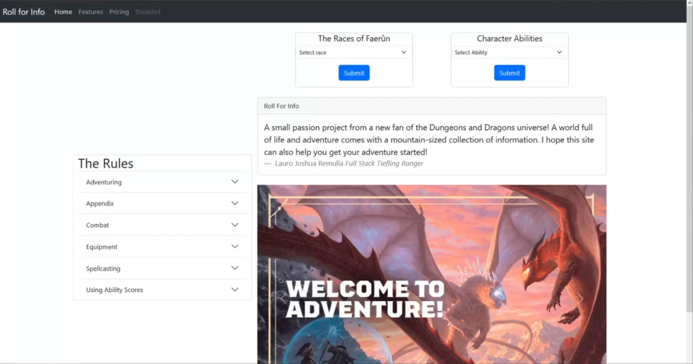

# Roll For Info

# About the Project

Much like many in the gaming world, I am now a new fan of the Dungeons and Dragons universe. I built this site with two focus points in mind: to refresh and sharpen my skills in Python and learn some more about the DnD universe as I go.
Enter Roll for Info! A simple web-app utilizing the Dungeons and Dragons API to several endpoints that presents basic to in-depth information about some of the high level concepts and mechanics of the game and its inhabitants. I have plenty of additions in mind as wide as the Sword Coast. Feel free to check back in the future to see updates!

# Roadmap
- [X] v1.0 repo uploaded
- [ ] Rules section added
- [ ] Monster Emporium
- [ ] Archive of Spells and Magic
- [ ] Login/Reg

# Live Demo
Watch the [Live Walkthrough](https://youtu.be/8y0qhDLhZYo) of the site!

# Built Using

- Python
- Javascript
- Flask
- Bootstrap
- [Dungeons and Dragons API](https://www.dnd5eapi.co/)

# Contact
- Lauro Joshua Remulla
   - Full Stack Dev
   - [My LinkedIn](https://www.linkedin.com/in/josh-remulla16/)
  
